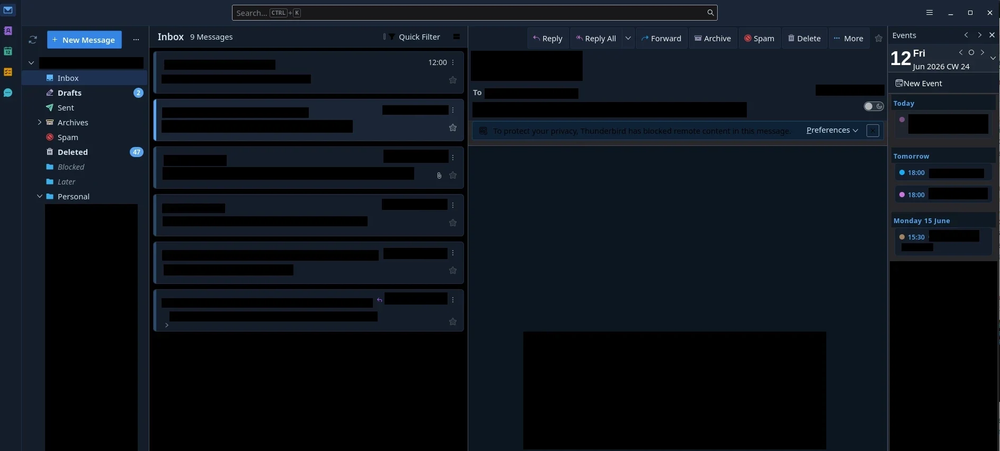
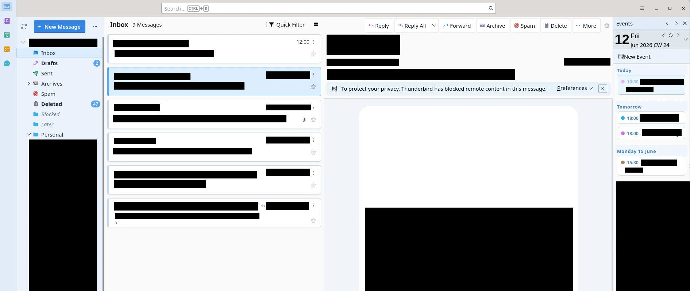

# Thunderbird Chrome Theme

A custom `userChrome.css` theme for Mozilla Thunderbird by **Rez**.

No external dependencies. Developed and tested on **KDE Linux** only - other
platforms are untested and may have rendering differences.

---

## Screenshots




---

## Design

### Tinted Layers

Both light and dark mode use a left-to-right progressive tint system so each
pane has a distinct visual weight:

| Pane           | Light     | Dark      |
| -------------- | --------- | --------- |
| Spaces sidebar | `#e2ecf8` | `#141e2b` |
| Folder tree    | `#eaf2fb` | `#141e2b` |
| Thread list    | `#f0f5fc` | `#0f1923` |
| Message body   | `#ffffff` | `#0f1923` |

### Icons

All icons are from **[Phosphor Icons](https://phosphoricons.com/)** (fill weight)
for a punchy, solid look inspired by KDE Breeze.

- Sidebar nav icons are coloured SVG files (colour baked in)
- Folder tree and header icons use `mask-image` + `background-color`
- Each icon type has its own accent colour (inbox blue, junk red, sent teal, etc.)

### Color Variables

All structural colours live in `parts/variables.css` - one file to retheme
everything. Both `userChrome.css` and `userContent.css` import it, so a single
change propagates to chrome UI and content pages (contacts, calendar) alike.

Icon colours are hardcoded in `parts/icons.css` with a palette comment at the
top - CSS variables don't cascade to icon elements in Thunderbird's XUL chrome.

---

## File Structure

```
chrome/                     ← copy this entire folder into your profile
├── userChrome.css          # Chrome UI - imports all parts/
├── userContent.css         # Content pages - imports variables + content/
├── parts/
│   ├── variables.css       # All color tokens (light + dark)
│   ├── icons.css           # All icon replacements
│   ├── spaces-toolbar.css  # Left nav sidebar
│   ├── folder-tree.css     # Folder/account tree
│   ├── thread-cards.css    # Email card rows
│   ├── message-header.css  # Email header (reply buttons, avatars)
│   ├── tabs.css            # Tab strip
│   ├── toolbars.css        # Main toolbar
│   ├── today-pane.css      # Events panel (right)
│   └── notifications.css   # Notification bars
├── content/
│   ├── address-book.css    # Contacts (about:addressbook)
│   └── email-body.css      # Message body
├── Icons/                  # Phosphor fill SVGs
└── Titlebar_Icons/         # Window control button icons
```

---

## Setup

1. Enable userChrome.css in Thunderbird:
   - **Settings → General → Config Editor**
   - Set `toolkit.legacyUserProfileCustomizations.stylesheets` → `true`
   - Restart Thunderbird

2. Set Thunderbird's theme to **System Theme** (not Light, Dark, or any add-on theme).

3. Copy the `chrome/` folder from this repo into your Thunderbird profile directory:
   - Find your profile folder: **Help → Troubleshooting Information → Profile Folder → Open Folder**
   - Copy the entire `chrome/` folder into that directory (create it if it doesn't exist)
   - The result should be: `<profile>/chrome/userChrome.css`, `<profile>/chrome/userContent.css`, etc.

4. Restart Thunderbird.

---

## Customising Colors

Open `chrome/parts/variables.css`. The `@media (prefers-color-scheme: light)` and
`@media (prefers-color-scheme: dark)` blocks each contain every structural
color token. Change values there and they apply everywhere.

For icon colors, edit the hex values in `chrome/parts/icons.css` - the palette is
listed in the comment block at the top of that file.

---

## Known Limitations

- Pop-up windows (compose, reply) cannot be themed - they live outside the
  chrome stylesheet scope.
- Thunderbird settings pages are in a Shadow DOM and cannot be styled.
- Contacts are fully themed for both light and dark mode.
- Calendar has minimal theming - the today pane (right-side event list) is
  styled, but the full calendar view is largely unstyled.
- Tasks and Chat have little to no custom styling.

---

## License

MIT - see [LICENSE](LICENSE). Use it however you like.
